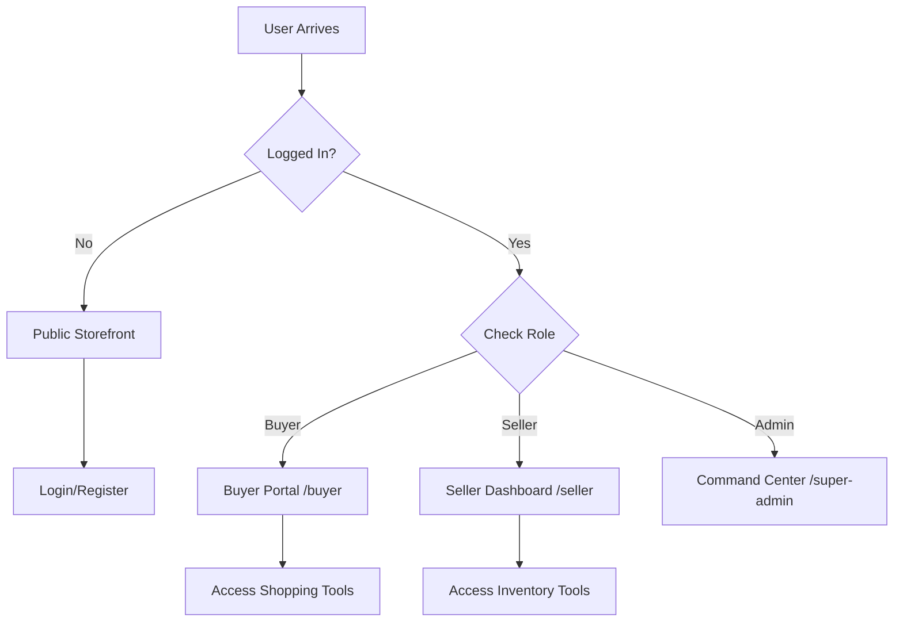

# 🏔️ Kashmir Direct: Platform Architecture & Workflow

Welcome to the official walkthrough of the **Kashmir Direct** ecosystem. This document explains how the platform operates, the roles of each user, and the technical stability we have built together.

---

## 🎯 1. Platform Vision
**Kashmir Direct** is an elite B2B and B2C artisan marketplace. It bridges the gap between local Kashmiri shopkeepers and global buyers using a high-security, role-based infrastructure.

- **Objective**: Direct artisan-to-buyer commerce.
- **Technology**: Next.js 15, Supabase, and Tailwind CSS.
- **Aesthetic**: Premium "Boutique" design with organic textures.

---

## 👥 2. User Roles & Workflows

### 🏛️ Super Admin (Command Center)
The global governor. Manages all products, verifies sellers, and oversees platform health.
- **Goal**: Platform integrity and quality control.
- **Key Task**: Approving artisans and managing global inventory.

### 🏪 Seller / Shopkeeper (Account Panel)
Local artisans and store owners.
- **Goal**: Direct sales and inventory management.
- **Key Task**: Uploading heritage products, tracking sales summary, and getting help.
- **Simplicity**: Terminology simplified (e.g., "Account" instead of "Node") for ease of use.

### 🛒 Buyer / Customer (Shopping Portal)
Private shoppers looking for heritage items.
- **Goal**: High-fidelity shopping experience.
- **Key Task**: Managing the Shopping Bag, saving to Wishlist, and tracking orders.
- **Security**: Shopping buttons ONLY appear when logged in and inside the Portal.

---

## 🔒 3. Authentication Flow (The Identity Vault)

---

## 🛡️ 4. What Antigravity (AI) Hardened Today

We fixed several "hidden bugs" to make the platform feel premium and stable:

1. **Ghost UI Elimination**: Icons no longer "float" over 404 pages or public pages.
2. **Instant Logout Overlay**: A clean, full-screen loader now hides all UI flickering during logout.
3. **Optimistic Identity Gating**: The system now checks permissions faster, preventing "blank page" flashes.
4. **Simple Language Modernization**: Technical jargon was replaced with plain English for local users.
5. **Add-to-Cart Security**: Shopping actions are now strictly "locked" inside the secure Buyer Portal.

---

### 🏛️ Technical Summary
The platform now uses a **Strict Folder-Based Routing** system. This means that a user's role determines exactly which code is loaded, preventing security leaks and ensuring a clean experience for everyone.

> [!TIP]
> To see the active bugs and future plans, check the `TECHNICAL_ISSUES.md` file in this folder.
